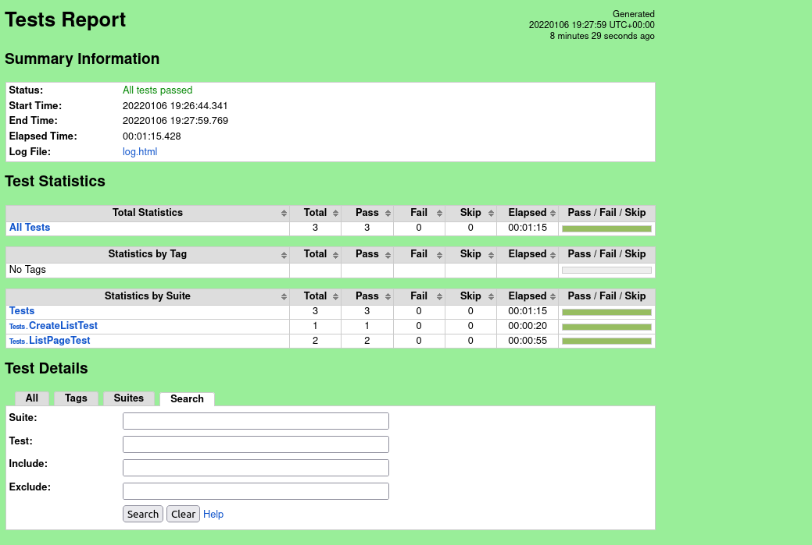

# Example of automated tests in RobotFramework and Appium
This repository contains UI test cases using RobotFramework and Appium for Listonic - mobile application.

# Test cases
| ID  | Test case | Description                                                                                        |
|-----|--------------|----------------------------------------------------------------------------------------------------|
| 001 | Create new shopping list | Click on fab button to create new list <br>Input list name and accept it<br>List should be created |
| 002 | Add item to the list   |   Create new list<br>Open Add Products to list view<br>Add product to the list<br>Product is visible on the list|
| 003 | Mark item as bought on the list |   Create new list<br>Add product to the list<br>Click on checkbox<br>Item is checked on the list|

# Run tests
1. Install requirements from requirements.txt
2. Download Listonic.apk file
3. Run gmsaas instances or use UDID of real device
4. Run appium server
5. Run tests from console
````
$ robot tests
````
# Report
Raport generated by RobotFramework:
